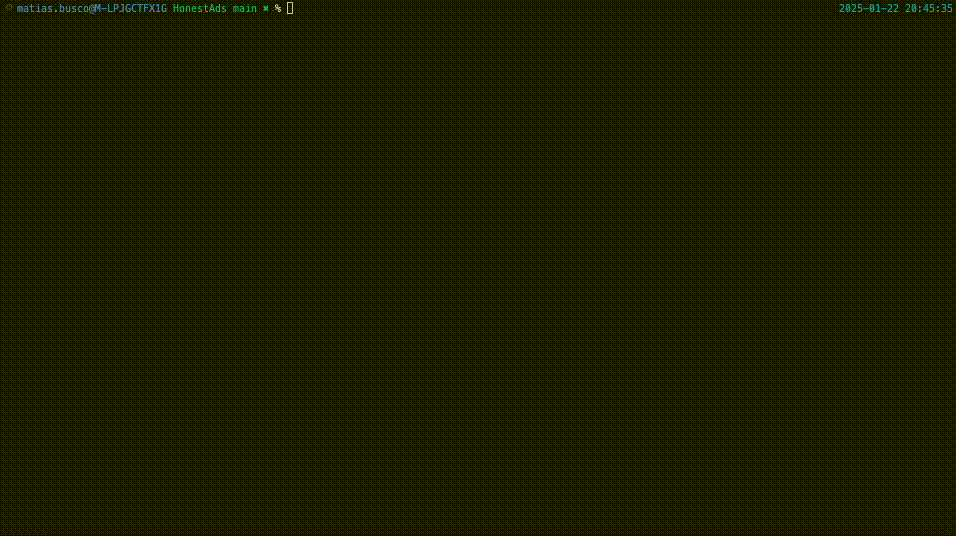

# HonestAds

Just a script to scrape and make the Google Ads transparency center more honest.

## Usage

For help:
```bash
./HonestAds -h
```

To see who is advertising on your domain:
```bash
./HonestAds yourdomain.com
```

## Screen Recording



## Options

- `--no_banner`: Do not print the banner.
- `search_value`: The domain/keyword to search by.
- `--filter_option`: Filter option: `domain`, `advertiser_name`, `no_filter`.
- `--exclude_option`: Exclude option: `domain`, `advertiser_name`, `no_exclusion`.
- `--info_option`: Information option: `all_information`, `keywords_only`.
- `--selected_suggestions`: Comma-separated list of selected suggestions.
- `--selected_domains`: Comma-separated list of selected domains.
- `--selected_advertiser_names`: Comma-separated list of selected advertiser names.
- `--excluded_domains`: Comma-separated list of excluded domains.
- `--excluded_advertiser_names`: Comma-separated list of excluded advertiser names.
- `--selected_keys`: Comma-separated list of selected keys.
